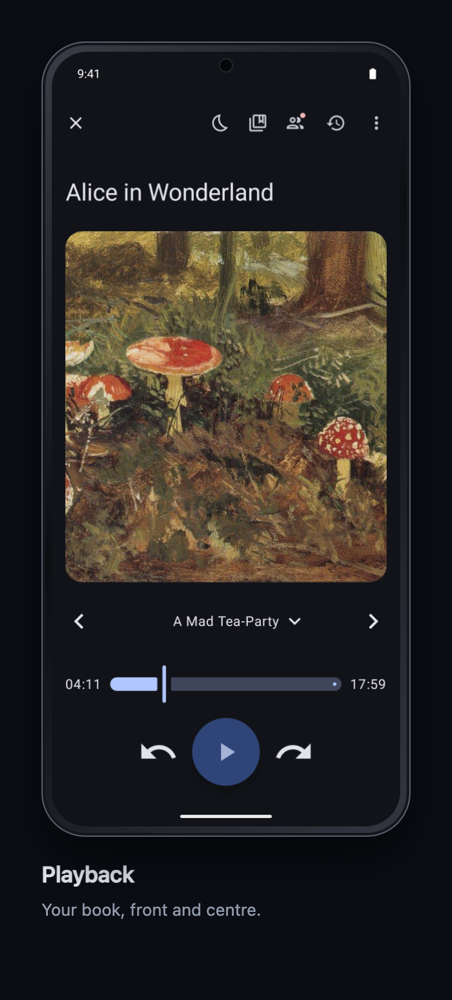
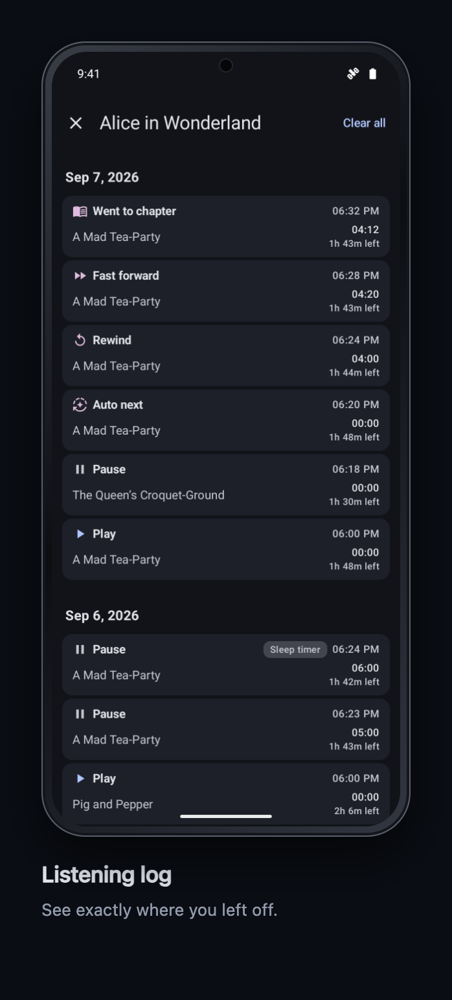
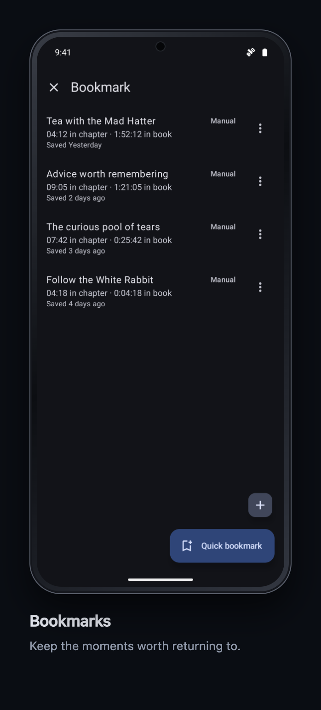
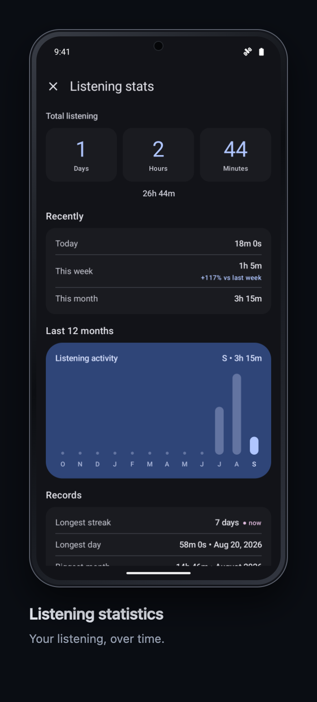
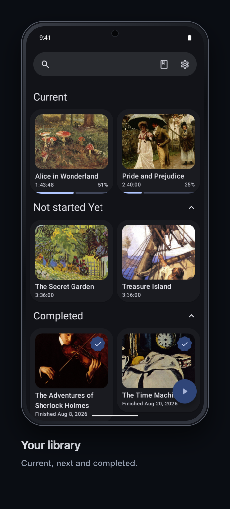
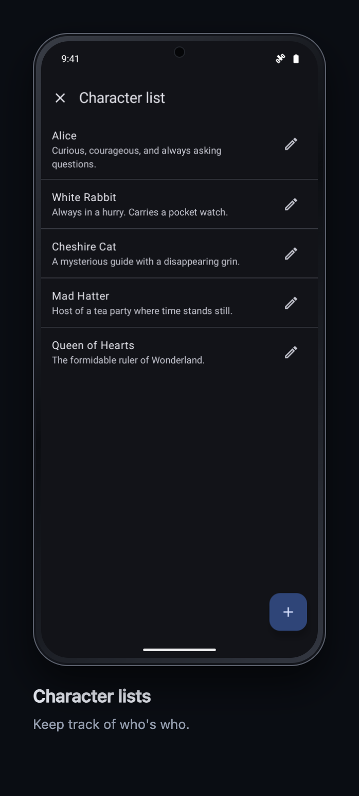
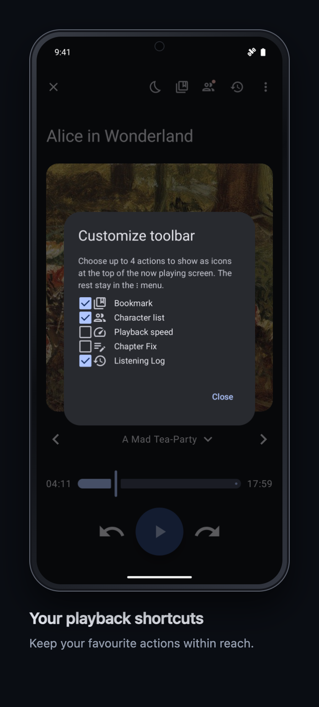
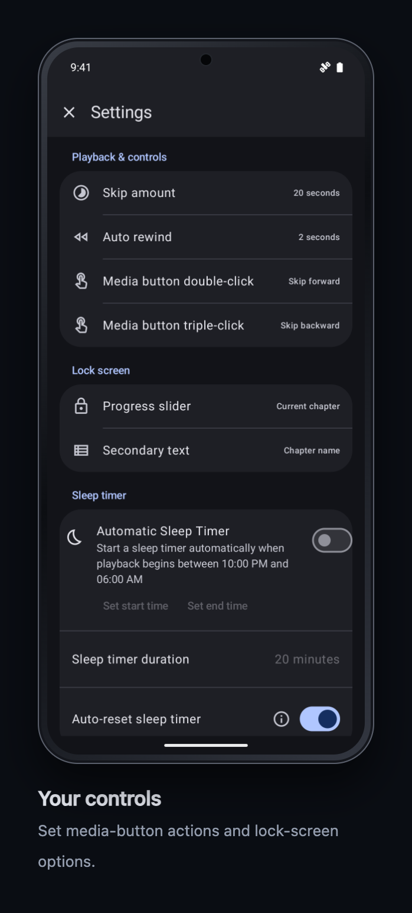
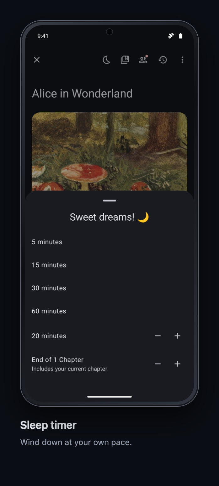

# VoicePlus

[](https://www.gnu.org/licenses/gpl-3.0)
[](https://f-droid.org/packages/com.github.mistermo_vibecode.voiceplus/)
[](https://github.com/Mistermo-vibecode/VoicePlus/releases)
[](https://github.com/Mistermo-vibecode/VoicePlus/actions/workflows/ci.yml)

A fork of [Voice](https://github.com/PaulWoitaschek/Voice) by Paul Woitaschek — a genuinely great audiobook app that I enjoyed but wanted something a bit different for myself. 

This started as a personal learning project by someone who had no idea what they were doing (and still isn't entirely sure). If you find it useful, great. Updates may happen. No promises.

## Screenshots

<p align="center">
  <a href="docs/screenshots/phone/playback.png"></a>
  <a href="docs/screenshots/phone/listening-log.png"></a>
  <a href="docs/screenshots/phone/bookmarks.png"></a>
</p>
<p align="center">
  <a href="docs/screenshots/phone/listening-statistics.png"></a>
  <a href="docs/screenshots/phone/library.png"></a>
  <a href="docs/screenshots/phone/characters.png"></a>
</p>

### Make it yours

<p align="center">
  <a href="docs/screenshots/phone/playback-toolbar.png"></a>
  <a href="docs/screenshots/phone/playback-settings.png"></a>
  <a href="docs/screenshots/phone/sleep-timer.png"></a>
</p>

---

## Why download this instead of Voice?

Honestly? You probably shouldn't. Voice is polished, actively maintained, and built by someone who knows what they're doing. Download that first.

But you can try both. If the features below add value to your listening experience then great. If not then no worries.

---

## What's new in v1.27

- Later Chapter Fix corrections preserve earlier chapter names and respect restored names
- Long-press menus work in search results — thanks [@JamesDBartlett3](https://github.com/JamesDBartlett3)
- Android Auto forward/rewind keys keep the correct direction without changing headset preferences — thanks [@geofgowan](https://github.com/geofgowan) for reporting

---

## What's different from Voice

- Listening Log with clear chapter positions and timestamps
- Listening Statistics with trends, records, finished books, and relisten counts
- Character lists for each book
- Smarter sleep timer with interaction reset and chapter countdowns
- Customizable lock-screen progress, secondary text, and playback controls
- Flexible backup and restore — encrypted Android system backup plus automatic and manual saves to a folder you choose
- Editable chapter names and tools to fix out-of-sync numbering
- Hide and restore books from the library
- Resizable widget with configurable opacity and text scale
- Customizable media button actions (double/triple press)
- Firebase removed entirely — no analytics or background telemetry

---

## Download

[](https://f-droid.org/packages/com.github.mistermo_vibecode.voiceplus/)

Or grab and sideload the APK from the [Releases](https://github.com/Mistermo-vibecode/VoicePlus/releases) page.

---

## Build from source

Requires JDK 21 and Android SDK. See `gradle/libs.versions.toml` for exact versions.

```bash
git clone https://github.com/Mistermo-vibecode/VoicePlus.git
cd VoicePlus
./gradlew :app:assembleLibreRelease
```

---

## License

GPL v3 — see [LICENSE.md](LICENSE.md).
Upstream Voice copyright Paul Woitaschek and contributors. VoicePlus modifications copyright Mistermo.
