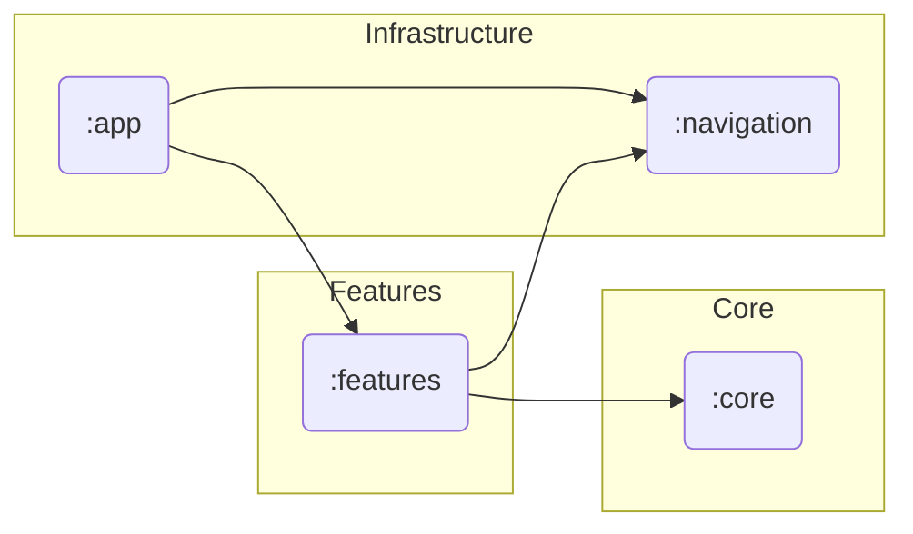

# Architecture

## Overview

VoicePlus is built on a **modular, layered architecture**, inherited from [Voice](https://github.com/PaulWoitaschek/Voice).
The design separates infrastructure, shared domain logic, and user-facing features.
This modularization improves build times, testability, and maintainability, while keeping feature ownership clear.

At a high level:

* **Infrastructure modules** provide the app entry point, build tooling, and navigation.
* **Core modules** encapsulate reusable domain and service logic (playback, scanning, data, logging, etc.).
* **Feature modules** implement user-facing screens, composed from core logic and UI components.
* **Feature flags** are defined per-feature via `:core:featureflag` and resolved locally — VoicePlus has no remote config.

## Layers

### Infrastructure

* `:app` – Main application entry point, dependency injection setup
* `:navigation` – Navigation framework abstractions and route definitions
* `:plugins` – Gradle build plugins for consistency and convention
* `:scripts` – Build and utility scripts

### Core (Shared Logic)

Core modules provide the underlying services and abstractions:

* **UI & Theming**

  * `:core:ui` – Shared UI components, typography, colors, Material 3 theming

* **Data & Storage**

  * `:core:data:api` – Interfaces for repositories and data sources
  * `:core:data:impl` – Implementations for Room and file access
  * `:core:documentfile` – File system abstractions

* **Playback & Media**

  * `:core:playback` – Audio playback logic using ExoPlayer
  * `:core:sleepTimer:api` & `:core:sleepTimer:impl` – Sleep timer contracts and implementation

* **Utility Modules**

  * `:core:scanner` – File scanning and metadata extraction
  * `:core:search` – Search logic
  * `:core:strings` – Localized string resources
  * `:core:common` – Shared utilities and primitives

* **Cross-Cutting Concerns**

  * App startup: `:core:initializer`
  * Logging: `:core:logging:api`, `:core:logging:debug`
  * Feature Flags: `:core:featureflag` – Local feature flag definitions

### Features

Feature modules are screen- or flow-based. Each module owns its UI (Compose) and presentation logic, while delegating to `:core` modules for
data and services:

* `:features:playbackScreen` – Main playback interface
* `:features:bookOverview` – Library / book list
* `:features:chapterEditor` – Chapter name editing and number correction
* `:features:characterList` – Per-book character roster
* `:features:listeningLog` – Per-book listening history
* `:features:listeningStats` – Library-wide listening statistics
* `:features:hiddenBooks` – Hidden-book management
* `:features:backup` – Snapshot backup & restore
* `:features:sleepTimer` – Sleep timer control UI
* `:features:settings` – App settings
* `:features:folderPicker` – Folder selection flow
* `:features:cover` – Cover art management
* `:features:onboarding` – First-time user flow
* `:features:bookmark` – Bookmark management
* `:features:widget` – Home-screen widget support
* `:features:review:noop` & `:features:review:play` – App review prompts (the shipped build uses `noop`)

## Dependency Flow

* Features depend **only on `:core` and infrastructure abstractions**.
* `:core` modules depend on each other as needed, but never on features.
* Infrastructure modules (`:app`, `:navigation`) wire everything together at runtime.

This ensures **unidirectional dependency flow**:

```
Infrastructure → Core → Features
```

## Diagram



## Tech Decisions

* **Compose (UI)** – Declarative UI with Material 3 for consistency and accessibility
* **Metro (DI)** – Lightweight dependency injection across modules
* **Navigation3** – Type-safe, modular navigation
* **ExoPlayer (Media3)** – Robust audio playback engine
* **Room** – Persistent storage
* **Kotlin Serialization** – JSON parsing and object serialization
* **Coil** – Efficient image loading
* **Fully offline** – No analytics, crash reporting, or remote config; VoicePlus makes no outbound network calls

## Module Lifecycle

1. **Add new functionality as a feature module.**
2. **Extract reusable logic into `:core` modules** once multiple features need it.
3. **Keep infrastructure minimal** — mainly for wiring and build configuration.
